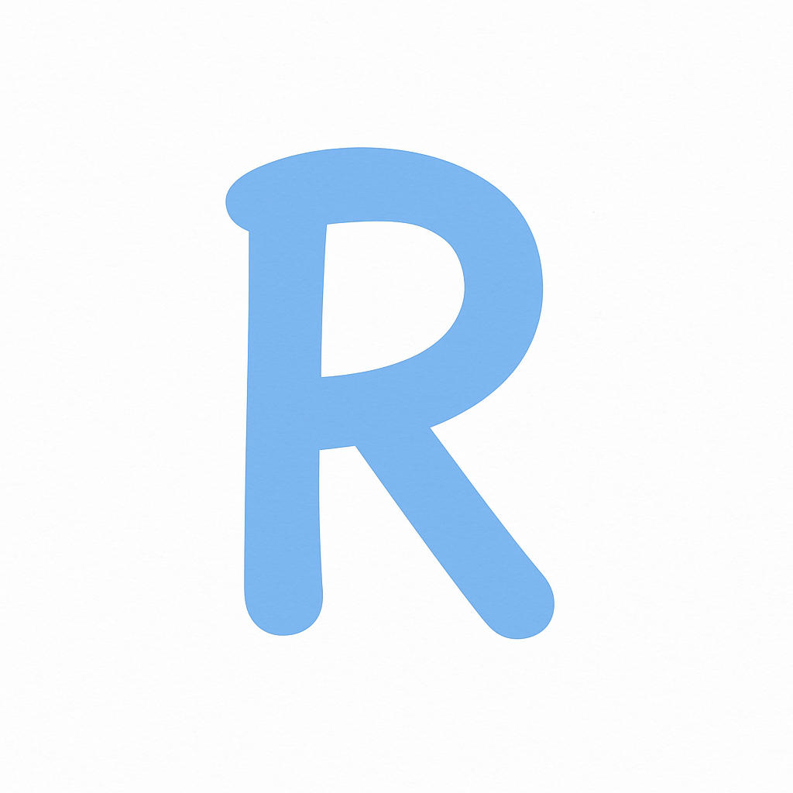
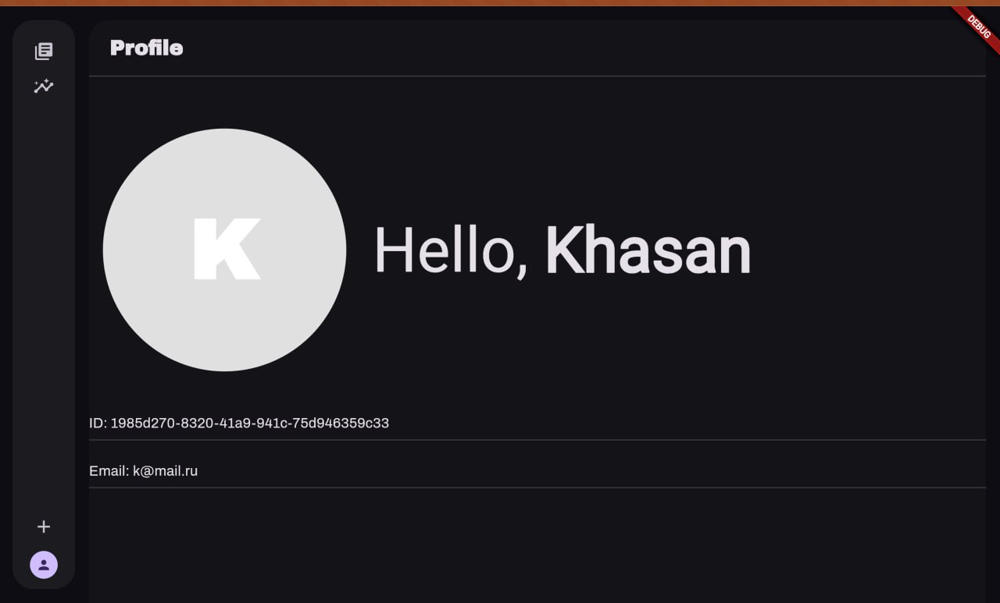
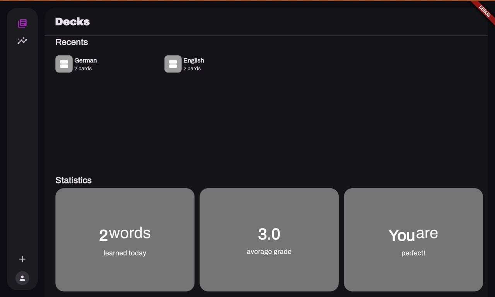
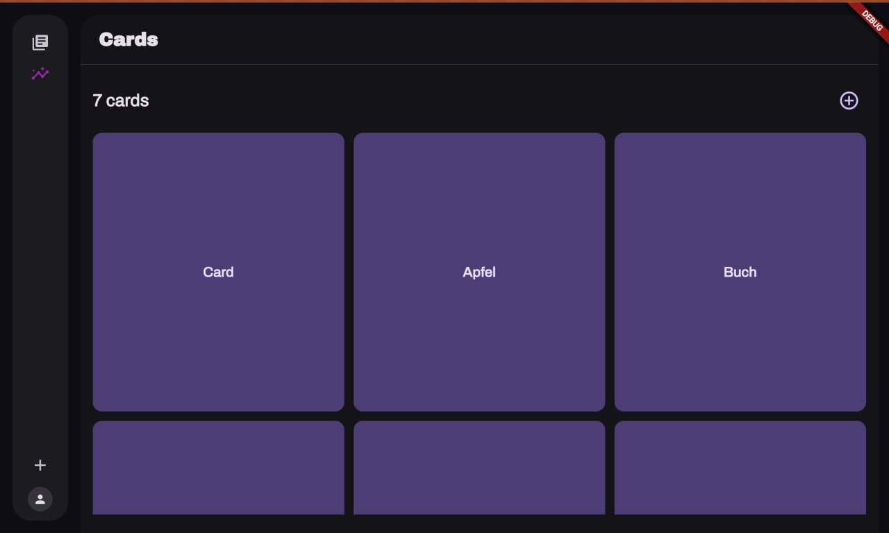
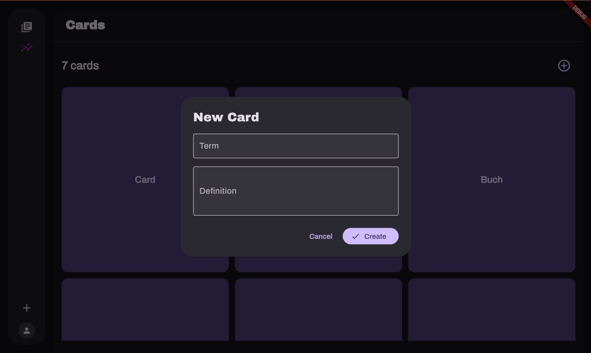
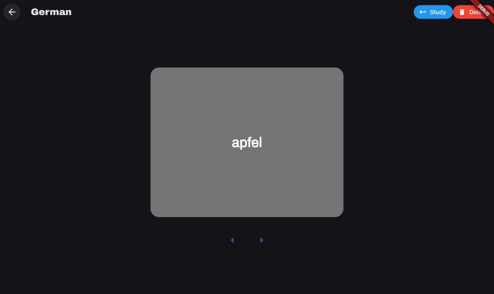
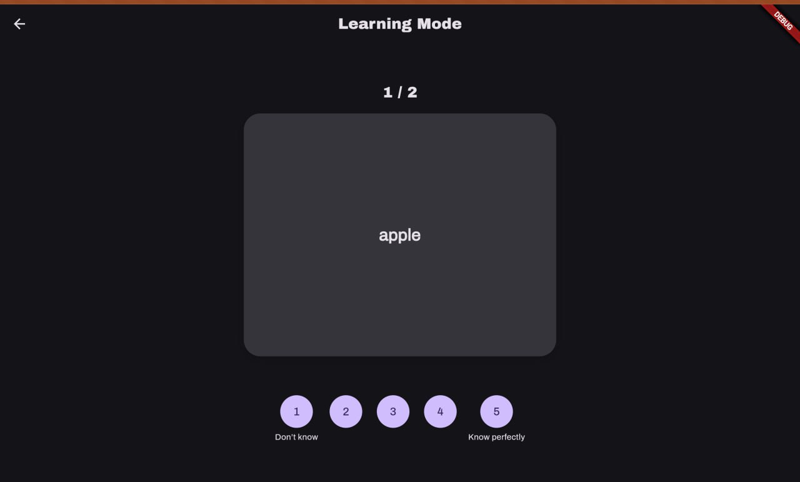

<!-- Improved compatibility of back to top link: See: https://github.com/othneildrew/Best-README-Template/pull/73 -->

<!-- PROJECT LOGO -->
 

  
  <h3 align="center">Repeatro</h3>
  

    A cross-platform vocabulary learning app powered by spaced repetition. 
    <a href="https://github.com/GOeda-Co/frontend"><strong>Frontend Repo »</strong></a>
    ·
    <a href="https://github.com/GOeda-Co/backend"><strong>Backend Repo »</strong></a>
  

---

## 📚 About The Project

**Repeatro** is a modern, open-source vocabulary learning platform inspired by Anki. It uses spaced repetition (SM2 algorithm) to help users memorize words more efficiently. The system is split into a microservice-based Go backend and a Flutter-based cross-platform frontend (web + mobile).

#Presentation link:
https://www.figma.com/deck/itCLoPXgMS4c6gWtNlkpkD/GoNFlutter_project_presentation?node-id=1-32&t=axClNxxHDzGnrPVT-1&scaling=min-zoom&content-scaling=fixed&page-id=0%3A1

.png)

##Key features

Users have a profile:

The main page with all created decks:

Users can view all created cards:

Add new cards:

Overview all cards in the deck:

Study cards to learn words:

### 🔧 Backend

- Developed in Go (Golang)
- PostgreSQL for storage
- Microservice architecture with REST and gRPC
- JWT-based user authentication
- Auto-generated Swagger docs
- Goose for DB migrations

### 💻 Frontend

- Built with Flutter & Dart
- Supports Web, Android, iOS, and Desktop
- Modern and responsive UI with dark/light modes
- State management with Provider
- Code generation for model serialization

---
## 📋 Implementation Checklist

### Technical Requirements (20 points)

#### Backend Development (8 points)
- [X] Go-based microservices architecture (minimum 3 services) (3 points)
- [X] RESTful API with Swagger documentation (1 point)
- [X] gRPC implementation for communication between microservices (1 point)
- [X] PostgreSQL database with proper schema design (1 point)
- [X] JWT-based authentication and authorization (1 point)
- [X] Comprehensive unit and integration tests (1 point)

#### Frontend Development (8 points)
- [X] Flutter-based cross-platform application (mobile + web) (3 points)
- [X] Responsive UI design with custom widgets (1 point)
- [X] State management implementation (1 point)
- [X] Offline data persistence (1 point)
- [X] Unit and widget tests (1 point)
- [X] Support light and dark mode (1 point)

#### DevOps & Deployment (4 points)
- [X] Docker compose for all services (1 point)
- [ ] CI/CD pipeline implementation (1 point)
- [X] Environment configuration management using config files (1 point)
- [ ] GitHub pages for the project (1 point)

### Non-Technical Requirements (10 points)

#### Project Management (4 points)
- [X] GitHub organization with well-maintained repository (1 point)
- [X] Regular commits and meaningful pull requests from all team members (1 point)
- [X] Project board (GitHub Projects) with task tracking (1 point)
- [X] Team member roles and responsibilities documentation (1 point)

#### Documentation (4 points)
- [X] Project overview and setup instructions (1 point)
- [X] Screenshots and GIFs of key features (1 point)
- [X] API documentation (1 point)
- [X] Architecture diagrams and explanations (1 point)

#### Code Quality (2 points)
- [ ] Consistent code style and formatting during CI/CD pipeline (1 point)
- [X] Code review participation and resolution (1 point)

### Bonus Features (up to 10 points)
- [ ] Localization for Russian (RU) and English (ENG) languages (2 points)
- [X] Good UI/UX design (up to 3 points)
- [ ] Integration with external APIs (fitness trackers, health devices) (up to 5 points)
- [X] Comprehensive error handling and user feedback (up to 2 points)
- [X] Advanced animations and transitions (up to 3 points)
- [ ] Widget implementation for native mobile elements (up to 2 points)

---

**Total points implemented:** XX/30 (excluding bonus points)
